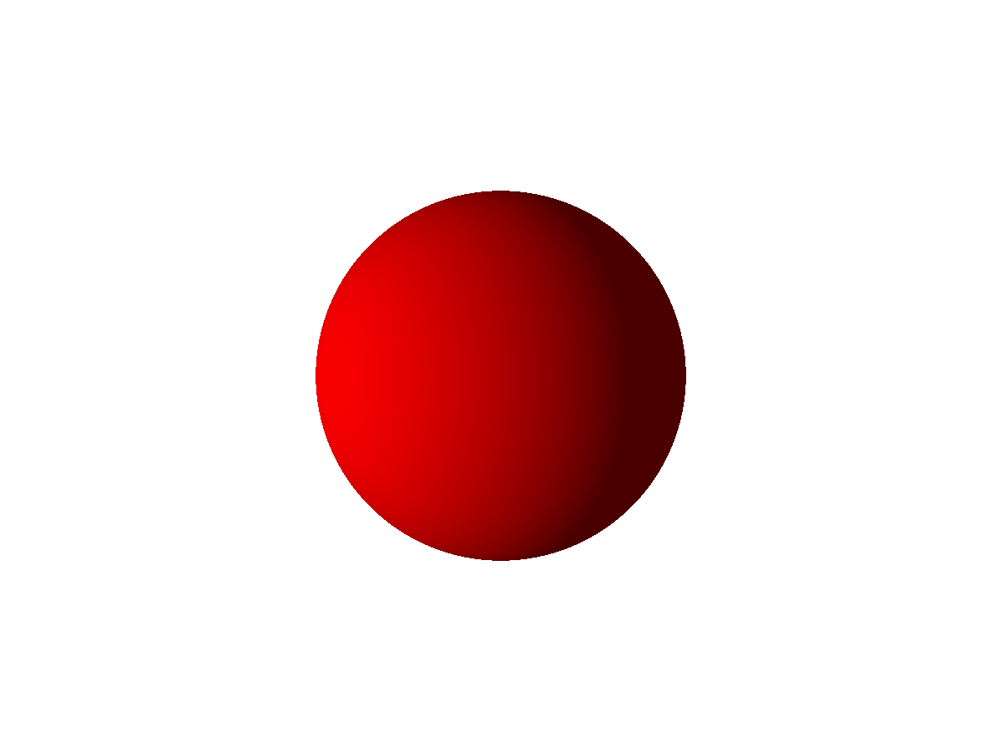
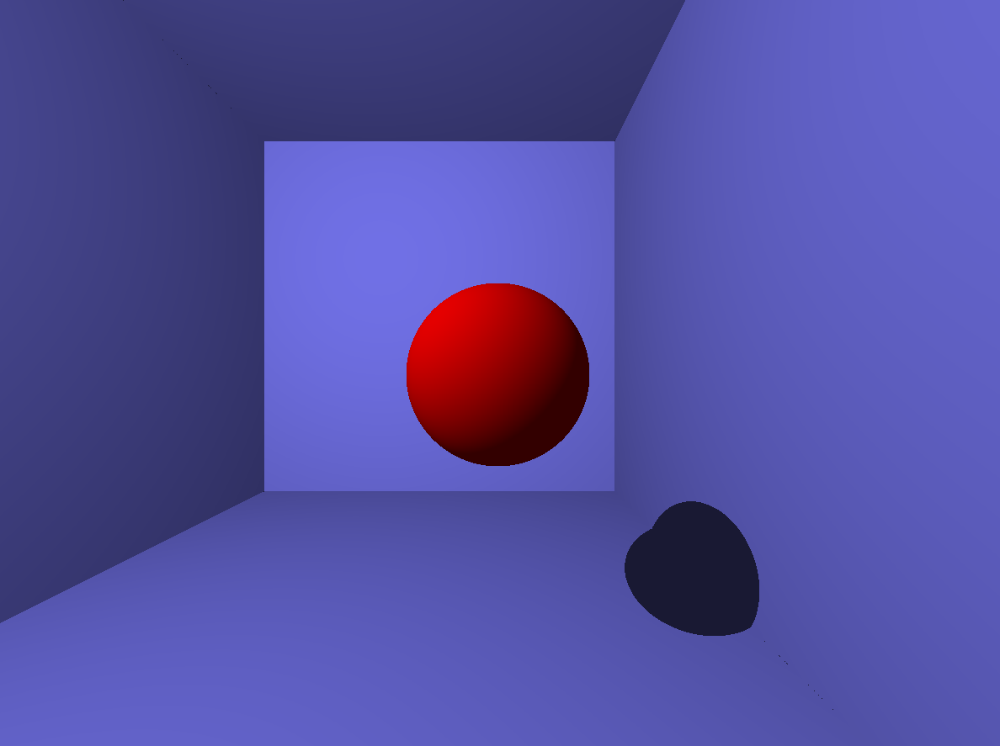
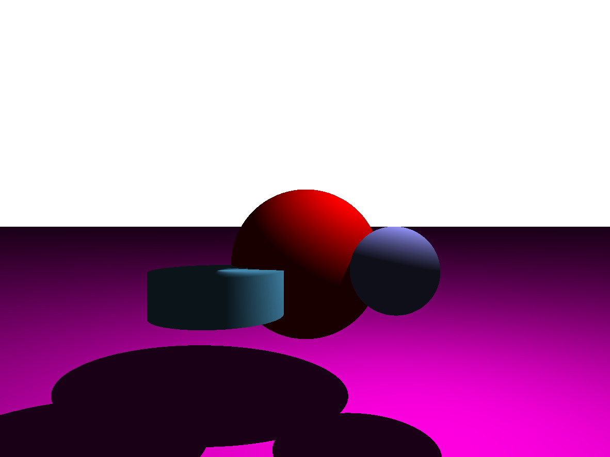
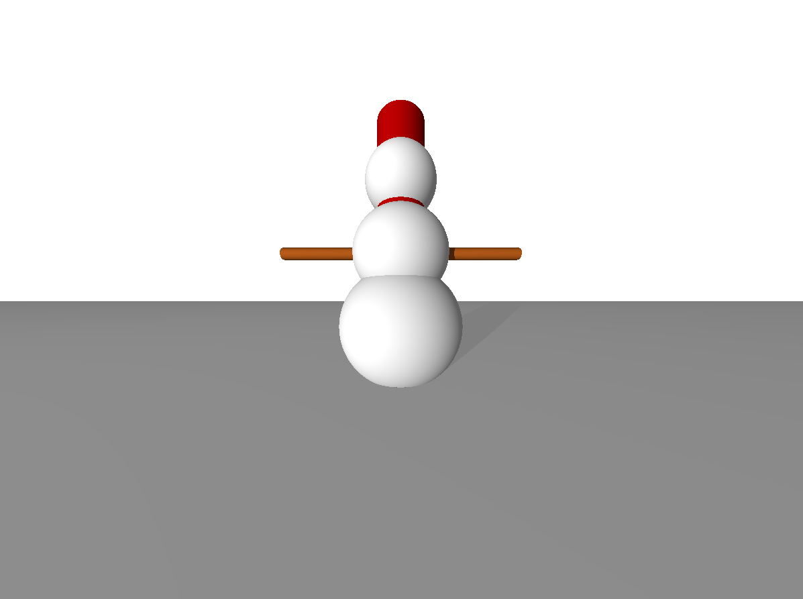
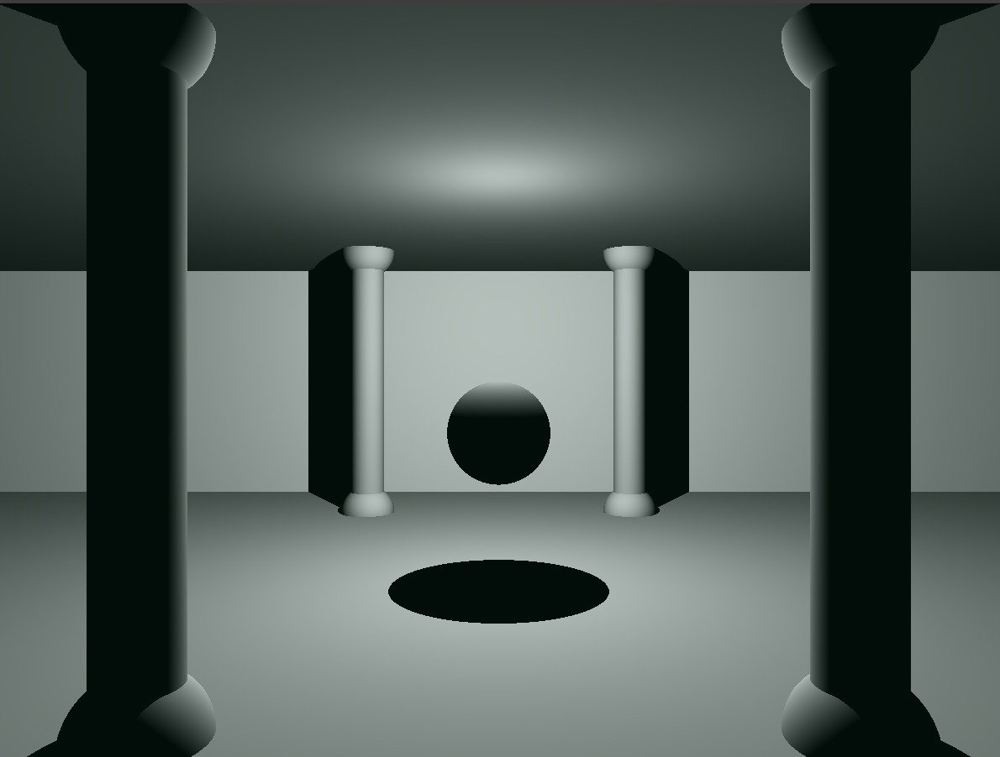
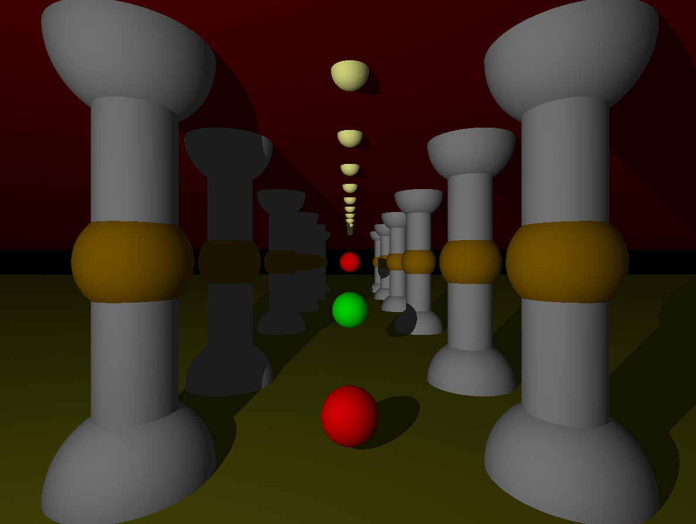

# **miniRT** 🌟

**MiniRT** is a ray tracing program 🖥️ designed to generate stunning 3D images from scenes described in `.rt` files. This project brings together geometry, lighting, and interactivity to deliver realistic rendered images. 🎨✨

---

## **🚀 Features**
- **🌐 Geometric Objects**: Render planes, spheres, and cylinders with precision.
- **💡 Lighting**: Realistic effects with ambient and diffuse lighting, hard shadows, and spot brightness.
- **🛠️ Transformations**:
  - Translate, rotate, and resize objects for complete scene control.
  - Adjust cameras and lights for dynamic perspectives.
- **📜 Scene Description**:
  - Simple `.rt` file format for scene configuration.
  - Handles invalid configurations with clear error messages.
- **🖼️ Real-Time Display**:
  - Rendered scenes are displayed in a **MiniLibX** window.
  - Fluid interactions with real-time updates.

---

## **🎮 Controls**

### **Camera** 🎥
- **Rotate**: `W`, `S`, `A`, `D`, `E`, `F`
- **Translate**: Arrow keys (`↑`, `↓`, `→`, `←`), `+`, `-`

### **Objects** 🔧
1. **Select Object**: Click on it with the **left mouse button**.
2. **Rotate**:
   - **X-axis**: `X`
   - **Y-axis**: `Y`
   - **Z-axis**: `Z`
3. **Translate**: `I`, `K`, `J`, `L`, `U`, `H`
4. **Resize**:
   - **Increase**: `1`
   - **Decrease**: `2`

### **Light** 💡
- **Translate**: `M`, `N`, `O`, `P`, `B`, `C`

### **Exit** 🚪
- **ESC**: Close the program.
- **Red Cross Button**: Exit via the window frame.

---

## **📝 Scene File Format (`.rt`)**

The scene file describes all elements of the scene with specific identifiers and attributes. Here’s an example:

```plaintext
A 0.2 255,255,255
C -50,0,20 0,0,1 70
L -40,0,30 0.7 255,255,255
pl 0,0,0 0,1.0,0 255,0,225
sp 0,0,20 20 255,0,0
cy 50.0,0.0,20.6 0,0,1.0 14.2 21.42 10,0,255
```

## 🖼️ Example Scenes

### 🌟 Sphere with Light
This scene demonstrates how a single light source interacts with a sphere.



### 📦 Sphere in the box
A sphere inside a box, with light casting shadows and highlights, creating a dynamic interplay of light and form.



### 🌀 Dual Spheres and Cylinder
This scene features two spheres and a cylinder, with realistic lighting and shadow effects.



### ⛄️ Complex Scene 0
A minimalistic scene featuring a snowman with basic geometric shapes, illuminated by soft lighting.



### 🏛️ Complex Scene 1
Scene showcasing a shiny metallic sphere placed at the center of a hall surrounded by towering columns, with elegant lighting creating shadows.



### 🌌 Complex Scene 2
Magical scene with grand, ornate columns resembling those from Aladdin's enchanted palace, bathed in warm light and shadow, creating an otherworldly, mystical atmosphere.



---

## 🚀 Getting Started

1. Clone this repository:
   ```bash
   git clone git@github.com:AnnLvu/42_miniRT.git
   cd miniRT
   ```

2. Compile the program using `make`:
   ```bash
   make
   ```
3. Run the program with a .rt scene file:
    ```bash
   ./miniRT file_rt/example.rt
   ```

